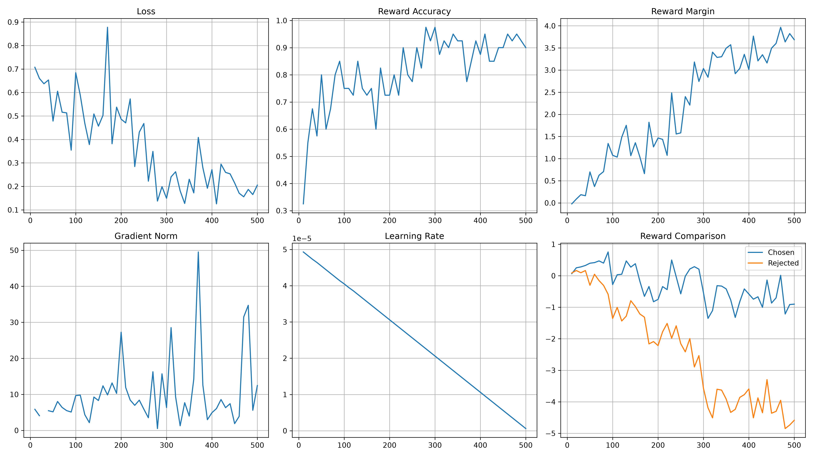
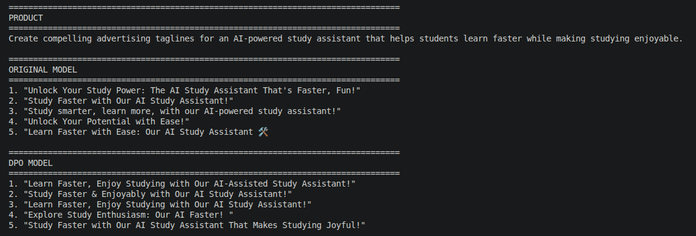

# RLHF Advertising Tagline Generator using Direct Preference Optimization (DPO)

> Built an end-to-end Reinforcement Learning from Human Feedback (RLHF) pipeline that collects human preference rankings and fine-tunes **Qwen2.5-0.5B-Instruct** using **LoRA-based Direct Preference Optimization (DPO)** for advertising tagline generation.

---

## Project Overview

Large Language Models often generate multiple plausible responses, but determining which response is *better* depends on human preference.

This project demonstrates a complete RLHF workflow by:

- Generating multiple tagline candidates using a base LLM
- Collecting human preference rankings
- Converting rankings into pairwise preference data
- Fine-tuning the model using **LoRA-based Direct Preference Optimization (DPO)**
- Comparing the original and fine-tuned models on unseen product descriptions

Unlike traditional supervised fine-tuning, DPO directly learns from human preferences without requiring a separate reward model.

---

## Features

- End-to-end RLHF workflow
- Manual human preference annotation (**100 prompts**)
- Automatic construction of **1,000 DPO preference pairs**
- Parameter-efficient LoRA fine-tuning
- Original vs. DPO model comparison
- Training metrics and convergence visualization
- Fully reproducible training and inference pipeline

---

## Tech Stack

| Category | Tools |
|-----------|-------|
| Base Model | Qwen2.5-0.5B-Instruct |
| Fine-tuning | TRL DPOTrainer |
| PEFT | LoRA |
| Framework | Hugging Face Transformers |
| Dataset | Human-ranked advertising taglines |
| Language | Python |
| Visualization | Matplotlib |
| Data Processing | Pandas |

---

# Project Structure

```text
RLHF_Advertising_Tagline_Generator/

├── data/
│   ├── candidates.csv
│   ├── rankings.csv
│   └── dpo_dataset.jsonl
│
├── logs/
│   └── dpo_training_metrics.csv
│
├── outputs/
│   ├── loss_curve.png
│   ├── reward_accuracy.png
│   ├── reward_margin.png
│   ├── gradient_norm.png
│   ├── learning_rate.png
│   └── training_dashboard.png
│
├── images/
│   ├── training_dashboard.png
│   └── inference_comparison.png
│
├── models/
│   └── dpo/
│
├── scripts/
│   ├── 01_generate_candidates.py
│   ├── 02_collect_preferences.py
│   ├── 03_build_dpo_dataset.py
│   ├── 05_train_dpo.py
│   ├── 06_inference.py
│   └── 07_plot_training_metrics.py
│
├── requirements.txt
└── README.md
```

---

# RLHF Pipeline

```text
Product Description
        │
        ▼
Generate 5 Candidate Taglines
        │
        ▼
Human Preference Ranking
        │
        ▼
Pairwise Preference Dataset
        │
        ▼
DPO Fine-tuning
        │
        ▼
Fine-tuned Model
        │
        ▼
Inference & Comparison
```

---

# Dataset

## Candidate Generation

- **100** product descriptions
- **5** generated taglines per description
- **500** generated taglines

---

## Human Preference Collection

Each product description was manually ranked from:

```text
Best
 ↓
2 5 1 4 3
Worst
```

---

## DPO Dataset

The rankings were automatically converted into pairwise preference examples.

Example:

```json
{
  "prompt": "...",
  "chosen": "...",
  "rejected": "..."
}
```

Final dataset:

- **100** prompts
- **1,000** preference pairs

---

# Model Training

### Base Model

```text
Qwen/Qwen2.5-0.5B-Instruct
```

### Training Method

- Direct Preference Optimization (DPO)
- LoRA Fine-tuning
- TRL DPOTrainer

---

# Training Metrics

The following metrics were tracked during DPO training:

- Training Loss
- Reward Accuracy
- Reward Margin
- Chosen Reward
- Rejected Reward
- Gradient Norm
- Learning Rate

<p align="center">
  
</p>

Generate the plots using:

```bash
python scripts/07_plot_training_metrics.py
```

---

# Inference

Run inference using:

```bash
python scripts/06_inference.py
```

Example:

```text
Input

An AI-powered yoga app that corrects your posture in real time.

Original Model

Stay Fit on the Go

DPO Model

Correct Your Posture with Our AI Yoga App!
```

---

# Inference Comparison

The following example demonstrates the difference between the original base model and the DPO fine-tuned model on an unseen prompt.

### Prompt

```text
Create compelling advertising taglines for an AI-powered study assistant that helps students learn faster while making studying enjoyable.
```

### Output

<p align="center">
  
</p>

### Observation

The base model generates more varied and creative taglines, whereas the DPO model consistently produces outputs that align more closely with the preference data used during training. Since the ranking process emphasized feature relevance and clear product messaging, the fine-tuned model prioritizes the product's core value proposition, demonstrating successful preference alignment through Direct Preference Optimization (DPO).

---

# Results

The DPO model learned to:

- Produce more relevant advertising taglines
- Better capture product features
- Follow human preference patterns
- Generate more consistent marketing messages
- Successfully align generation with manually annotated preferences

---

# Installation

```bash
git clone https://github.com/UditHazoary/RLHF_Advertising_Tagline_Generator.git

cd RLHF_Advertising_Tagline_Generator

python -m venv venv

source venv/bin/activate

pip install -r requirements.txt
```

---

# Future Improvements

- Larger human preference dataset
- Better prompt engineering
- Stronger base LLM (3B–7B)
- Automatic evaluation (BLEU, ROUGE, BERTScore)
- Web interface using Streamlit
- Reward Model + PPO comparison

---

# Acknowledgements

- Hugging Face Transformers
- TRL
- PEFT
- Qwen Team
- OpenAI RLHF research